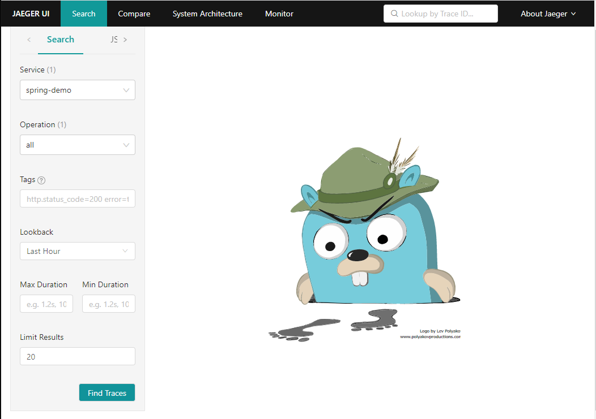
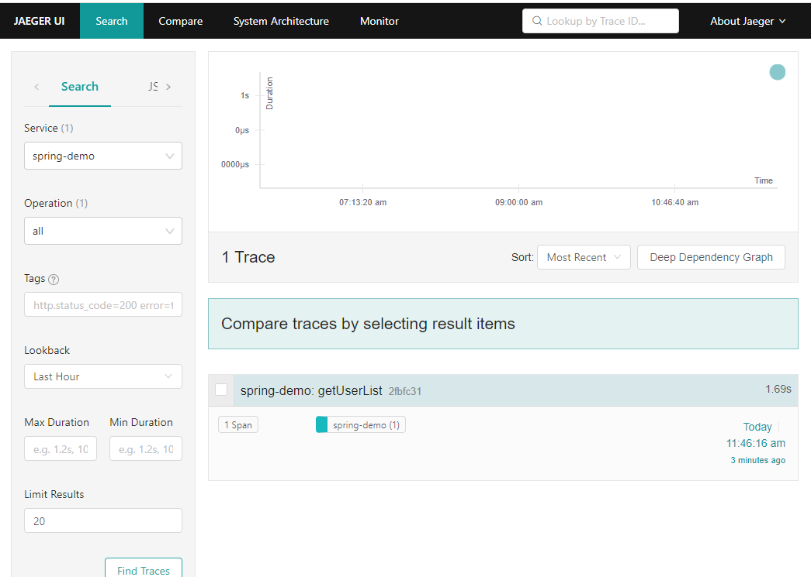
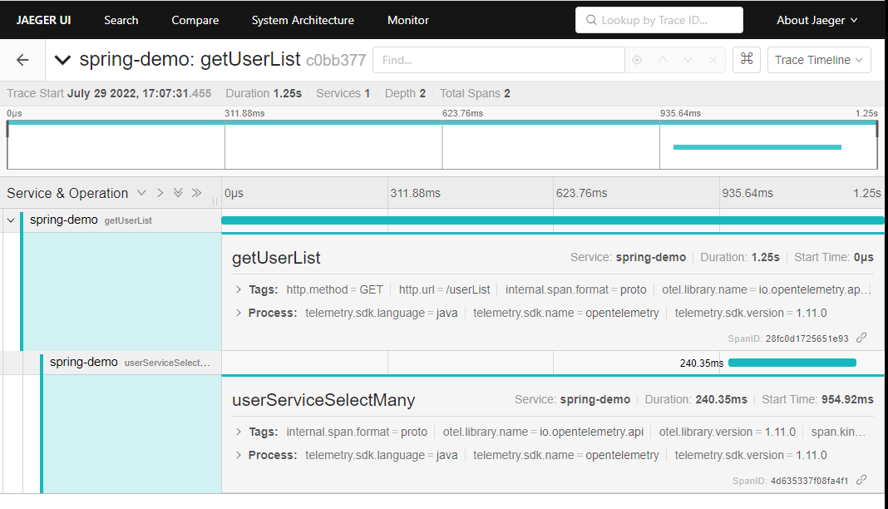

### Trace を確認する

- 作業概要
    - Jaeger にアクセスして Trace を確認する。
- 作業手順
    - [Jager画面にアクセスする]({{TRAFFIC_HOST1_16686}})
        - ポートは16686
    - Service に「spring-demo」が表示された状態で、「Find Traces」をクリックする。
        - spring-demo は環境変数で設定した値である。
        
    - spring-demo サービスの getUserList Trace が表示される。
        
    - getUserList Trace をクリックすると、詳細が表示され、Span を確認できる
        - getUserList Span の下に userServiceSelectMany Span ができている。
        - userServiceSelectMany Span の Tags に設定した SQL が表示されている。
        
