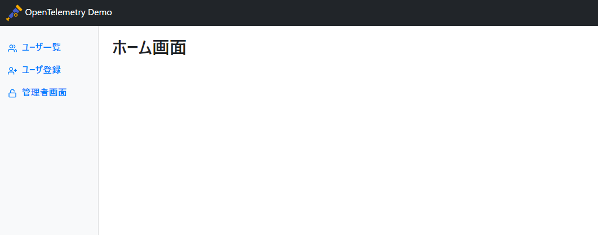
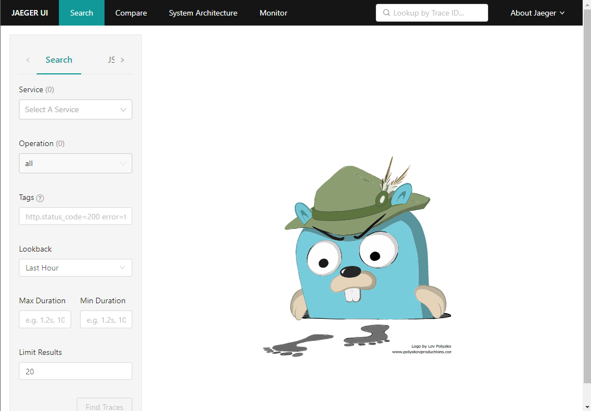

### 手順

1. [サンプルアプリケーションにアクセスする]({{TRAFFIC_HOST1_8080}}/home)
   - ポートは8080
   - パス : <https://{ホスト名}/home>
   - 502 Bad Gatewayが表示された場合は少し時間をあけて再読み込み

2. [Jager画面にアクセスする]({{TRAFFIC_HOST1_16686}})
   - ポートは16686

### 完了条件

下記２つの画面が表示されたら次へ

### 参考

Logoutボタンの下にあるハンバーガーメニュー（3本線）をクリックして、「Traffic / Ports」を選択すると、ポートを指定したアクセスが可能