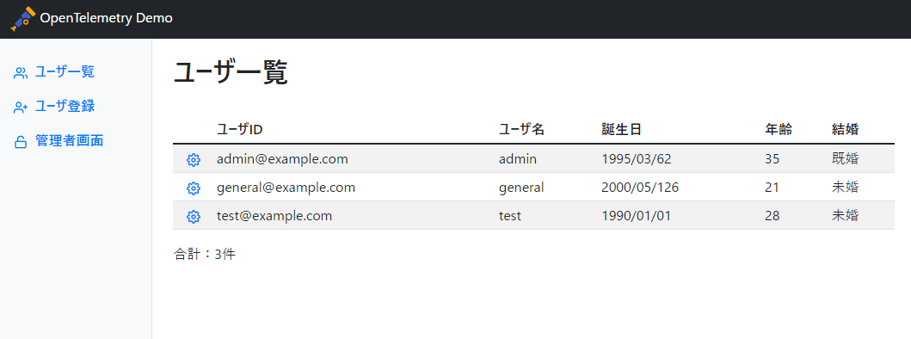

### 5. 監視コードを埋め込んだリクエストを実行する

- 作業概要
    - ログインすることで監視コードに埋め込んだ getUserList メソッドを実行する。
- 作業手順
    - [ユーザ一覧画面にアクセスする]({{TRAFFIC_HOST1_8080}}/userList)
        - ポートは8080
        - パス : <https://{ホスト名}/userList>
        - 502 Bad Gatewayが表示された場合は少し時間をあけて再読み込み
    - ユーザ一覧画面が表示される。
        - これにより Span を設定した getUserList メソッドが呼び出される。
    
