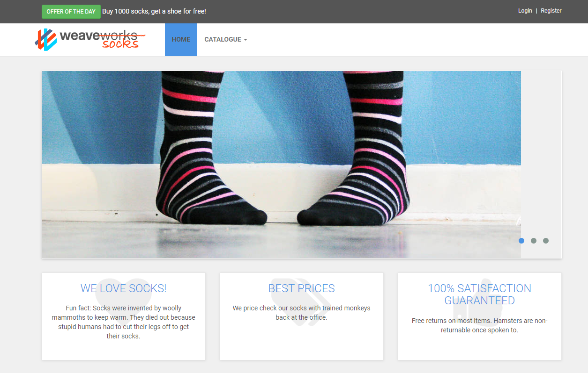

## 概要

- 本章ではマイクロサービスのサンプルアプリとして知られている Sock Shop というサンプルマイクロサービスアプリを使用する。
- [こちら](https://github.com/microservices-demo/microservices-demo)からダウンロードできる。
    - 既に環境にクローン済み
- [HP](https://microservices-demo.github.io/)にデプロイ方法が説明されている。
- ここではdocker-composeを用いてデプロイする。

## 起動

1. ディレクトリの移動

    ```bash
    cd ~/microservices-demo
    ```{{exec}}

1. サンプルアプリケーションを起動 ※数分程度かかる

    ```bash
    docker-compose -f deploy/docker-compose/docker-compose.yml up -d
    ```{{exec}}

1. すべてUpであることを確認する

    ```bash
    docker-compose -f deploy/docker-compose/docker-compose.yml ps
    ```{{exec}}

## 画面へアクセス

1. [サンプルアプリケーションにアクセスする]({{TRAFFIC_HOST1_80}})
    - Traffic / Portsで80を指定して開いてもOKです。
    - 普通のECサイトなので画面の説明は割愛します。



<!-- ## 停止

1. サンプルアプリケーションを停止

    ```bash
    docker-compose -f deploy/docker-compose/docker-compose.yml down
    ```{{exec}} -->