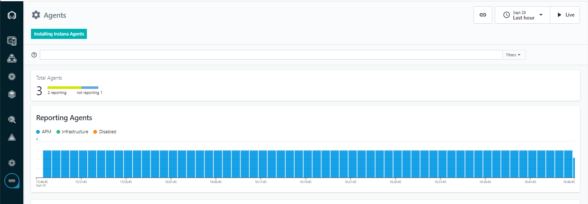
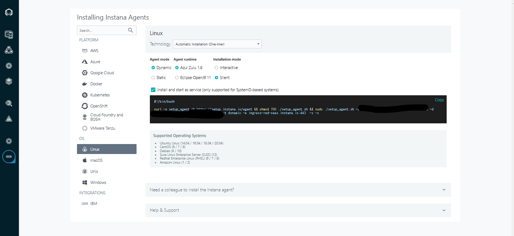
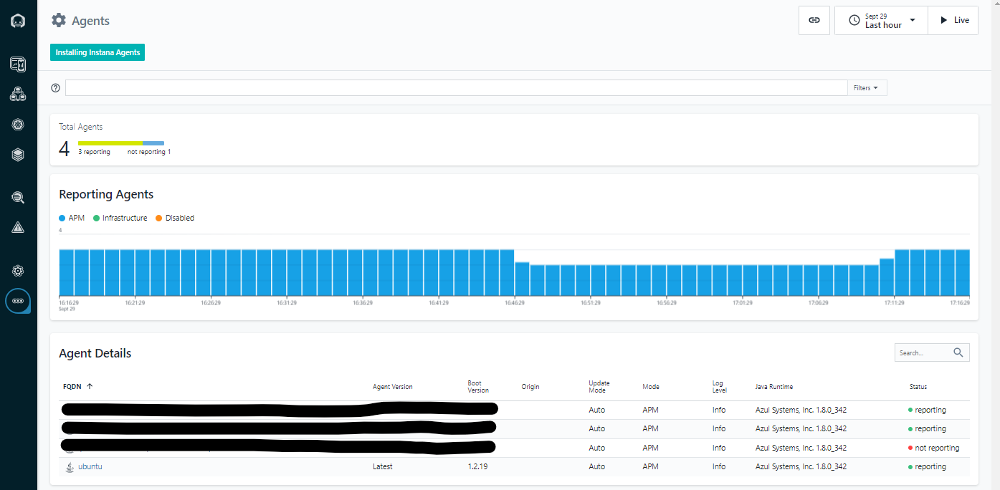
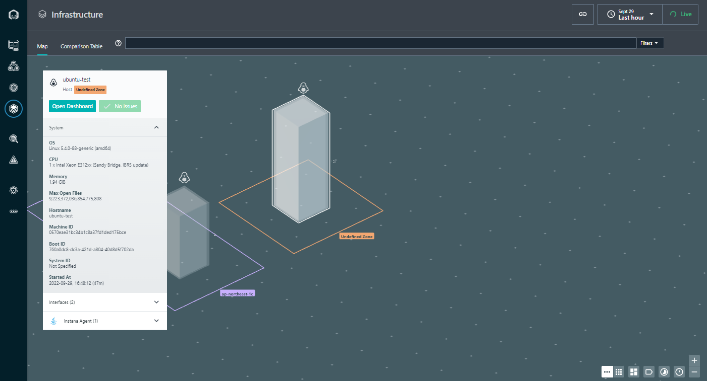

## エージェントを導入する

- 作業概要
    - 環境にエージェントをインストールする
- 作業手順
    - 受講者のホストだとわかるようにホスト名を変更しておく

        ```bash
        hostnamectl set-hostname <hostname>
        ```

    - 管理画面のサイドバーで"More"→"Agents"をクリックするとエージェント管理画面が開く。
        
    - "Installing Instana Agents"をクリックするとインストール画面が開く。
    - PLATFORM で"Linux"をクリックする。
    - Technology で"Automatic Installation (One-liner)"を選択する。
        - Agent mode: Dynamic
        - Agent runtime: Azul Zulu 1.8
        - Installation mode: Silent
        - Install and start as serviceにチェックを入れる
        
    - 画面に表示されたコマンドをコピーしてターミナルで実行する

    - エージェントが起動していることを確認する。

        - active(running)が表示されれば OK。
        - コマンド実行後"q"を入力するとターミナルに戻る

        ```bash
        systemctl status instana-agent
        ```{{exec}}

        - エージェントが起動していない場合は下記コマンドを実行する。

        ```bash
        systemctl start instana-agent
        ```{{exec}}

    - エージェントの自動起動の設定をする ※設定しなくても今回は問題ない

        ```bash
        systemctl enable instana-agent
        ```{{exec}}

    - エージェント管理画面に戻って確認する。

        - 右上の Live ボタンを押してスタートさせる。
        - 一定時間後、Agent Detail に自分のホスト名が表示される。
            - 最初の手順で変更しないとubuntuというホスト名になる。
        

    - インフラストラクチャ画面にも表示される。
        - サイドバーの"Infrastructure"をクリックする。
        - 現在エージェントで確認できるホストやコンテナが一覧化される。
        - ホストを選択すると OS や CPU などインフラ情報が自動で取得できていることが確認できる。
        - "Open Dashboard"をクリックすれば、詳細も確認できる。
        
