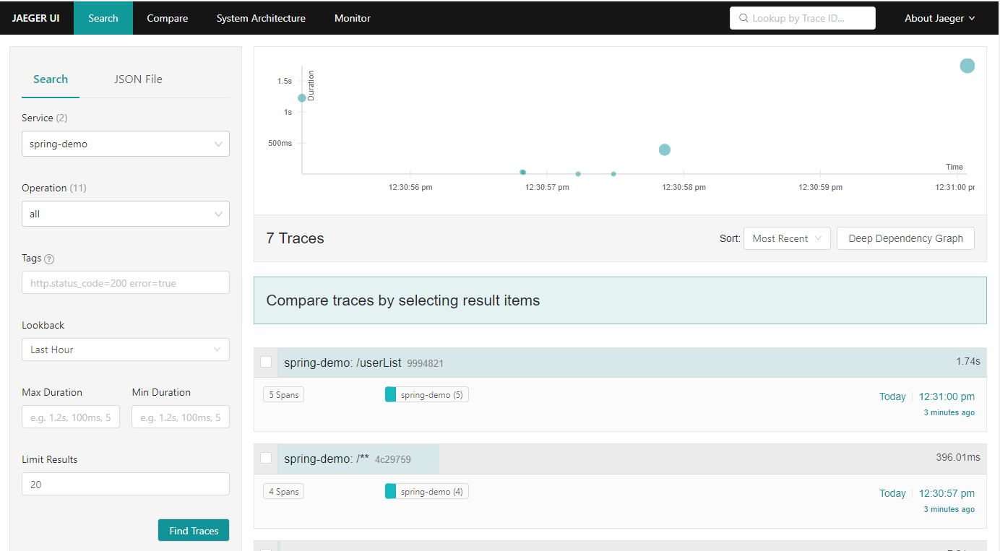
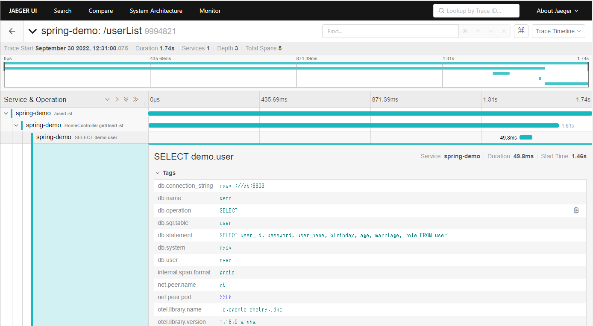

## Trace を確認する

- 作業概要
    - Jaeger にアクセスして Trace を確認する。
- 作業手順
    - [Jager画面にアクセスする]({{TRAFFIC_HOST1_16686}})
        - ポートは16686
        
    - Service に「spring-demo」が表示された状態で、「Find Traces」をクリックすると、Traceが色々ととれることを確認する。
        
    - /userList Trace をクリックすると、Spanが確認取れる。
        - 折りたたまれていたらそれぞれをクリックして広げることができる。
        - Tagsの中にテーブル名やSQL文が自動で取得できていることが確認できる。
        
