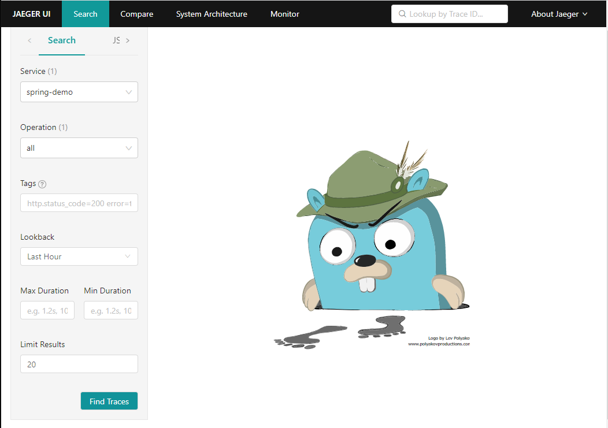

## Trace を確認する

- 作業概要
    - Jaeger にアクセスして Trace を確認する。
- 作業手順
    - [Jager画面にアクセスする]({{TRAFFIC_HOST1_16686}})
        - ポートは16686
    - Service に「spring-demo」が表示された状態で、「Find Traces」をクリックする。
        - spring-demo は環境変数で設定した値である。
        
    - spring-demo サービスの getUserList Trace が表示される。
        - 上のグラフ上には各 Span の実行時間が分布図として表示される。
        - getUserList は監視コードを埋め込む手順のポイント 3 で設定した値である。
        
    - getUserList Trace をクリックすると、詳細が表示され、ルート Span を確認できる。
        - 折りたたまれていたらそれぞれをクリックして広げることができる。
        - Tags の中にライブラリ名・バージョンが設定した値で表示されている。
        - Tags の中に監視コードを埋め込む手順のポイント 2 で設定したライブラリのバージョンが表示される。
        - Tags の中に監視コードを埋め込む手順のポイント 4 で設定した http.method や http.url が表示される。
        

- 補足
    - ユーザ一覧画面に何回かアクセスすると Span が複数溜まっていくので確認してみてください。