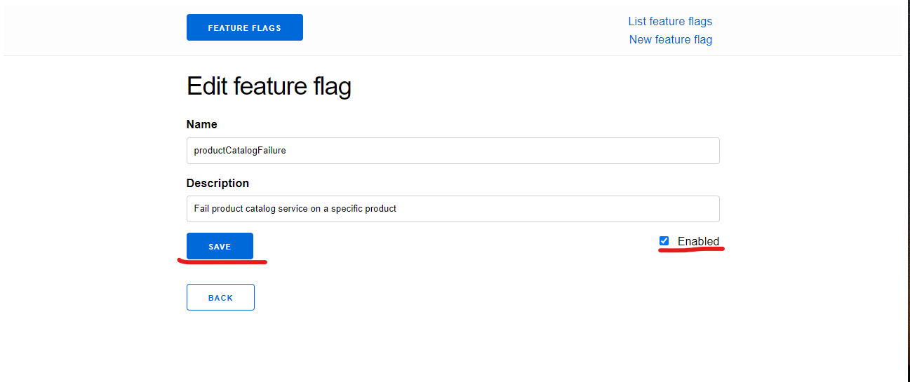

前の手順で確認したオブザーバビリティツールはサービスの依存関係を知るだけでなく、エラーの特定にも役に立つ。本手順ではそれを体感する。

opentelemetry-demoではfeature flagサービスでエラーを発生させることができる。

| Feature Flag | サービス | 説明 |
| ---- | ---- | ---- |
| adServiceFailure | ad-servcie | 10分の1の確率でGetAdsのリクエストがエラーになる。|
| cartServiceFailure | cart-service | 10分の1の確率でEmptyCartのリクエストがエラーになる |
| productCatalogFailure | product-catalog-service | product idがOLJCESPC7Zに関するGetProductが必ずエラーになる |
| recommendationCache | recommendation-service | キャッシュの増大に伴いメモリリークが発生する |

参照：[公式サイト](https://opentelemetry.io/docs/demo/feature-flags/)

### Feature Flagを有効にする

Feature Flag Serviceにアクセスする。
frontend-proxyで確認した通り/featureにルーティングされている。

- Killercodaでは[こちら]({{TRAFFIC_HOST1_8080}}/feature)からアクセスする
- ローカルで起動している場合は<https://localhost:8080/feature>でアクセスできる

今回はproductCatalogFailureを起こす。
1. productCatalogFailureの行のEditを選択する
2. Enabledをチェックする
3. Saveで保存する
4. Backして一覧に戻るとEnabledがtrueになっていることが確認できる

### Jaegerでエラーを確認する

前の手順同様、Jaegerにアクセスする。

- Killercodaでは[こちら]({{TRAFFIC_HOST1_8080}}/jaeger/ui)からアクセスする
- ローカルで起動している場合は<https://localhost:8080/jaeger/ui>でアクセスできる

エラーが発生しているトレースを検索する。
- Service : frontend ※productcatalogserviceでもいい
- Tags : error=true

トレースを選択すると、対象のProdcut IdにGetProductしたときにエラーが発生していることがわかる。
※具体的な根本原因をログに出力するよう作りこめばもっと原因を特定しやすくなる。

