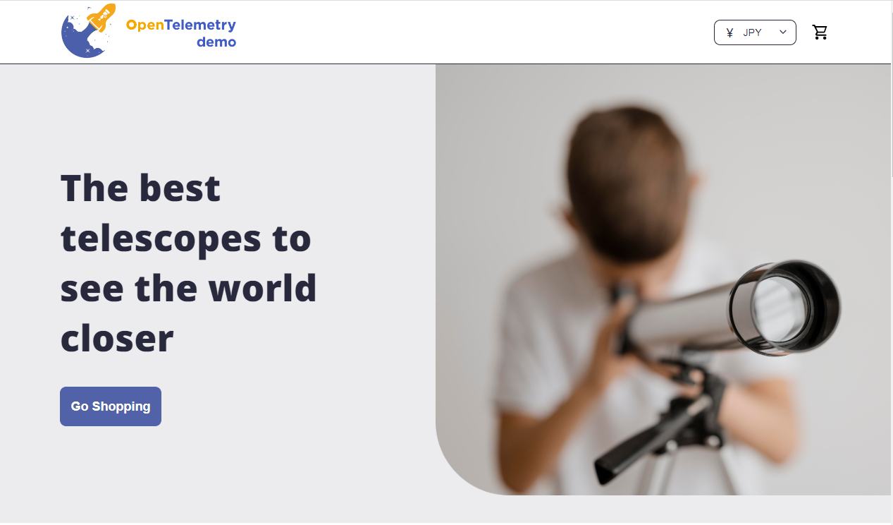
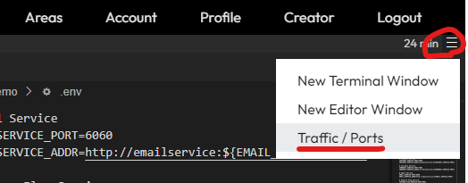

[こちら](https://opentelemetry.io/docs/demo/architecture/)のアーキテクチャ図に書いてある通りfrontend-proxy経由でアクセスする。

### 設定の確認

まずはEditorを開いて設定を確認する。

ポート情報は環境変数にて設定されている
```env
// file: opentelemetry-demo.env

# Frontend
FRONTEND_PORT=8080
FRONTEND_ADDR=frontend:${FRONTEND_PORT}

# Frontend Proxy (Envoy)
FRONTEND_HOST=frontend
ENVOY_PORT=8080
```
proxyのルーティング設定はenvoyを使って下記で設定されている

```yaml
# opentelemetry-demo/src/frontend-proxy/envoy.tmpl.yaml
# 28行目
routes:
- match: { prefix: "/feature" }
    route: { cluster: featureflag, prefix_rewrite: "/" }
- match: { prefix: "/loadgen" }
    route: { cluster: loadgen, prefix_rewrite: "/" }
- match: { prefix: "/jaeger" }
    route: { cluster: jaeger }
- match: { prefix: "/grafana" }
    route: { cluster: grafana }
- match: { prefix: "/" }
    route: { cluster: frontend }
```

### フロントエンドへアクセスしてみる

ということでまずはフロントエンドへアクセスしてみる。

1. frontend, frontend-proxyの8080ポートが公開されていることを確認する

    ```bash
    docker compose ps | grep frontend
    ```{{exec}}


2. frontendにアクセスする
   - Killercodaでは[こちら]({{TRAFFIC_HOST1_8080}})からアクセスする
   - ローカルで起動している場合は<http://localhost:8080>でアクセスできる

3. 下記２つの画面が表示されたら次へ。
   - 適当に何か購入してみてください。




### 参考

Logoutボタンの下にあるハンバーガーメニュー（3本線）をクリックして、「Traffic / Ports」を選択すると、ポートを指定したアクセスが可能

