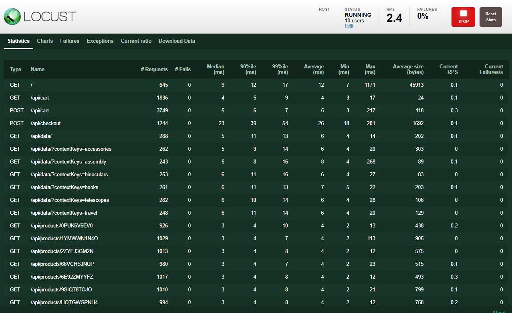
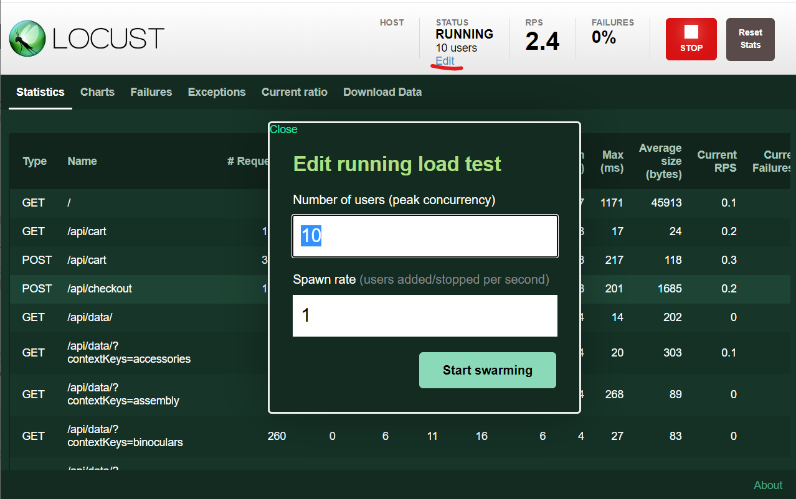

opentelemetry-demoでは負荷掛けツールとしてLocustを使用している。
Locustによって何もしなくても自動的にAPIのアクセスの今日を確認できる。

実際にLocustのGUI画面にアクセスしてみる。

### 設定の確認

まずはEditorを開いて負荷掛けスクリプトを確認する。
ここで定義しているのは1ユーザ分の負荷である。

```python
# file: opentelemetry-demo/src/loadgenerator/locustfile.py

class WebsiteUser(HttpUser):
    # タスク間の時間、1~10秒の間のランダムの秒数となる
    wait_time = between(1, 10)

    # ()の値は呼ばれる回数の比重
    @task(1)
    def index(self):
        self.client.get("/")

    @task(10)
    def browse_product(self):
        self.client.get("/api/products/" + random.choice(products))

    @task(3)
    def get_recommendations(self):
        params = {
            "productIds": [random.choice(products)],
        }
        self.client.get("/api/recommendations", params=params)

    # 以下略
```

同時実行数については環境変数にて設定されれている

```env
# Load Generator
LOCUST_WEB_PORT=8089
LOCUST_USERS=10
LOCUST_HOST=http://${FRONTEND_PROXY_ADDR}
LOCUST_WEB_HOST=loadgenerator
LOCUST_AUTOSTART=true
LOCUST_HEADLESS=false
```

### Locustへアクセスしてみる

1. Locustにアクセスする。frontend-proxyで確認した通り/loadgen/でルーティングされる。
   - Killercodaでは[こちら]({{TRAFFIC_HOST1_8080}}/loadgen/)からアクセスする
   - ローカルで起動している場合は<http://localhost:8080/loadgen/>でアクセスできる

1. 下記画面が表示される
   - 右上のボタンで負荷の停止/再開をすることが可能
    

1. Editボタンで同時に実行するユーザ数や1秒当たりのユーザの増加数を修正できる
    
