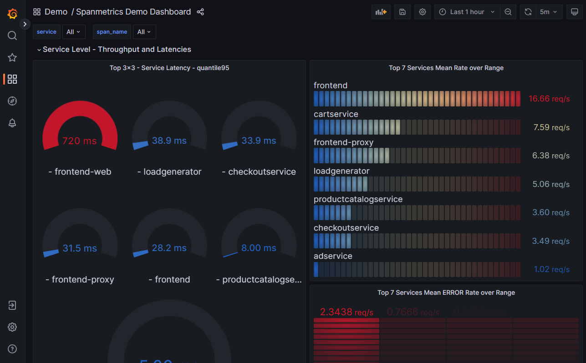
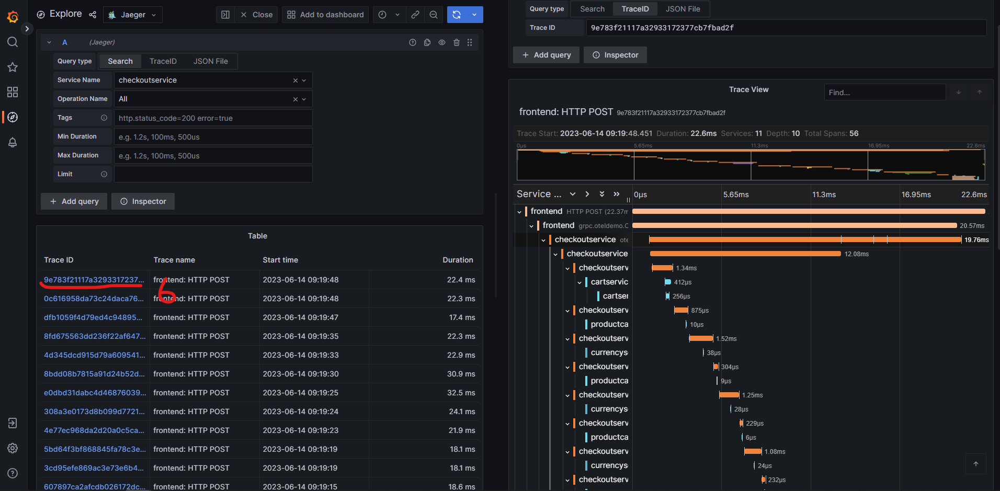

本シナリオでは負荷情報やエラー情報を可視化するオブザーバビリティツールを触ってみる。
opentelemetry-demoでは下記環境が用意されている。

| プロダクト | 説明 |
| ---- | ---- |
| Prometheus | メトリクスデータを受信あるいは取得し保管する |
| Grafana | Prometheusなどに保存されている監視データをグラフ化する |
| Jaeger | OpenTelemetryによって取得されたトレース情報を保存および可視化する |

詳細は別の勉強会で説明するのでお楽しみに。

### Prometheus

Prometheusにアクセスする。
通常、後述のGrafanaからアクセスするためfrontend-proxyでルーティングはされていない。そのためポート9090を直接指定してアクセスする。

- Killercodaでは[こちら]({{TRAFFIC_HOST1_9090}})からアクセスする
- ローカルで起動している場合は<http://localhost:9090>でアクセスできる

### Grafana

Grafanaにアクセスする。
frontend-proxyで確認した通り/grafanaにルーティングされている。

- Killercodaでは[こちら]({{TRAFFIC_HOST1_8080}}/grafana)からアクセスする
- ローカルで起動している場合は<http://localhost:8080/grafana>でアクセスできる

正方形が4つのマークをクリックしてダッシュボード一覧を確認する。
既にダッシュボードも作りこんでくれていることがわかる。

Demo DashboardやSpanmetrics Demo Dashboardを開くとCPU使用率などのメトリクスが取れていることがわかる。
※Killercodaの環境ではサービスが指定できない。おそらく環境起因。

### Jaeger

Jaegerにアクセスする。
frontend-proxyで確認した通り/jaegerにルーティングされている。

- Killercodaでは[こちら]({{TRAFFIC_HOST1_8080}}/jaeger/ui)からアクセスする
- ローカルで起動している場合は<http://localhost:8080/jaeger/ui>でアクセスできる

一番サービス連携が多いcheckoutserviceを選択してfind tracesボタンを押す。
すると、トレース一覧が出てくるのでどれか一つをクリックすると多種多様なサービスが連携して動いていることがわかる。

Jaegerの画面でSystem Architecture > DAGを選択するとアーキテクチャ図に書いてあったようにサービスの依存関係をグラフ化してくれる。トレースを可視化するツールに本機能が備わっていることが多い。

### 番外編：GrafanaでJaegerを確認する

実はGrafanaでJaegerのトレースを確認することもできる。

1. Grafanaにアクセスして左ペインのExploreを選択
2. Exploreの右のプルダウンでJaegerに切り替える
3. Query TypeをSearchに変更する
4. Service Nameで適当なサービスを選択する
5. 右上のRun queryを実行する
6. 出てきたトレースのどれかを選択するとJaegerと同じトレース画面を見ることができる

